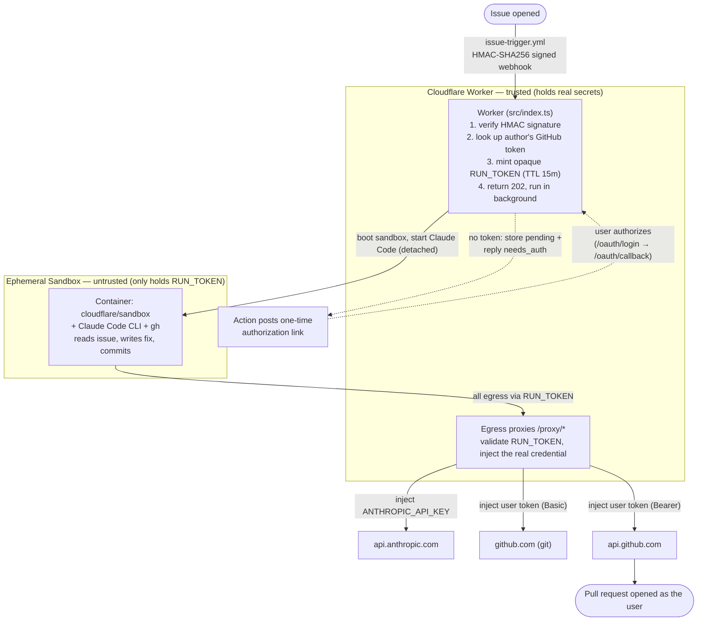

# Cloudflare Sandbox Coding Agent

[](https://deploy.workers.cloudflare.com/?url=https://github.com/leo-ars/cloudflare-sandbox-coding-agent)

**Turn a GitHub issue into a pull request, automatically.** Open an issue, and an
autonomous coding agent ([Claude Code](https://docs.anthropic.com/en/docs/claude-code))
reads it, writes the fix, and opens a PR — running inside an ephemeral
[Cloudflare Sandbox](https://developers.cloudflare.com/sandbox/) container that
never sees a single one of your secrets.

```
issue opened ──▶ GitHub Action ──▶ Cloudflare Worker ──▶ Sandbox (Claude Code) ──▶ Pull Request
```

---

## What it does

1. You open an issue describing a bug or a change.
2. A GitHub Action sends a signed webhook to a Cloudflare Worker.
3. The Worker spins up a throwaway Sandbox container and runs Claude Code in it.
4. Claude Code clones the repo, understands the code, implements a focused fix, and commits.
5. The branch is pushed and a pull request is opened **as you** — then the sandbox is gone.

The agent comments on the issue as it works (`🤖 On it…` → `✅ opened PR …`), so
there's always a trail of what happened.

## How it works



## Design highlights

### Triggered by a GitHub issue
A tiny workflow (`issue-trigger.yml`) fires on `issues: [opened]`, builds a JSON
payload, signs it with **HMAC-SHA256**, and POSTs it to the Worker. The Worker
rejects anything whose signature doesn't verify, so only your repos can trigger runs.

### Claude Code in an ephemeral Cloudflare Sandbox
Each run gets a fresh, isolated container built from the official
`cloudflare/sandbox` image plus the Claude Code CLI and `gh`. It clones the repo,
runs the agent headlessly, and is torn down afterwards — no shared state between runs.

### OAuth flow for user impersonation
Work is done **on behalf of a real GitHub user**, not a bot account. Each developer
authorizes once via a standard browser OAuth flow (`/oauth/login` → `/oauth/callback`).
Their access token is encrypted (AES-256-GCM) and stored in KV, keyed by login.
When they open an issue, the resulting commits are pushed and the PR is opened under
their identity. First-time users are detected automatically and sent a one-time
authorization link as an issue comment; the moment they authorize, the issue they
already opened is **picked up and resolved automatically** — no need to re-open or re-file.

### No secrets in the sandbox — outbound-worker credential injection
The container is treated as untrusted. It never receives the Anthropic key or any
GitHub token. Instead it gets a per-run **`RUN_TOKEN`**: a random, opaque value that
is worthless on its own, expires in 15 minutes, and only works through the Worker.
All egress (Anthropic, git, GitHub API) is routed to the Worker's `/proxy/*`
endpoints, which validate the `RUN_TOKEN` and swap in the real credential *outside*
the sandbox before forwarding upstream. This is the shipped Sandbox-SDK equivalent
of the "outbound worker credential injection" pattern.

### Anti self-PR approval (a property of impersonation)
Because the PR is opened **as the issue author**, GitHub's built-in rule that *you
cannot approve your own pull request* applies for free. The person who requested the
change can't rubber-stamp the AI's output — a second human has to review and approve
before merge. Impersonation isn't just a nicety; it's what makes independent review
non-optional. (Pair it with a branch-protection rule requiring one approval to enforce
merge-time.)

## Repository layout

| Path | Purpose |
|------|---------|
| `.github/workflows/issue-trigger.yml` | Signs the issue payload and POSTs it to the Worker; posts the auth link when needed |
| `src/index.ts` | Request router + `info` page; re-exports the Sandbox Durable Object |
| `src/webhook.ts` | Signed webhook handler (verify → resolve token → launch or `needs_auth`) |
| `src/oauth.ts` | GitHub OAuth login + callback (per-user token, auto-resume) |
| `src/runs.ts` | Run lifecycle: pending queue, run-token minting, sandbox boot, token lookup |
| `src/agent.ts` | The prompt + bash wrapper that run inside the sandbox |
| `src/proxies.ts` | The three credential-injecting egress proxies |
| `src/crypto.ts` | HMAC verification + AES-256-GCM encryption of tokens at rest |
| `src/http.ts` | Small header / encoding / base64url helpers |
| `src/types.ts` | Shared interfaces (`Env`, `RunContext`, `PendingRun`) |
| `wrangler.jsonc` | Worker + Container + Durable Object + KV configuration |
| `.dev.vars.example` | Secret names the Deploy to Cloudflare button prompts for |
| `Dockerfile` | Sandbox image: `cloudflare/sandbox` + Claude Code CLI + `gh` |

## One-click deploy

[](https://deploy.workers.cloudflare.com/?url=https://github.com/leo-ars/cloudflare-sandbox-coding-agent)

The button clones this repo into your account, provisions the KV namespaces and
Durable Object, builds the container image, and prompts you for the secrets
declared in `.dev.vars.example` (`WEBHOOK_SECRET`, `TOKEN_ENC_KEY`,
`ANTHROPIC_API_KEY`). Then finish the instance-specific bits:

1. **Set `PUBLIC_URL`** to your new Worker's URL (Worker → Settings → Variables &
   Secrets) and redeploy — the OAuth callback and sandbox egress proxy are built from it.
2. **Register a GitHub OAuth App** (Settings → Developer settings → OAuth Apps → New):
   - Homepage URL: `https://<your-worker>.workers.dev`
   - Authorization callback URL: `https://<your-worker>.workers.dev/oauth/callback`

   then set the two secrets:
   ```sh
   printf '%s' "<client id>"     | npx wrangler secret put GITHUB_CLIENT_ID
   printf '%s' "<client secret>" | npx wrangler secret put GITHUB_CLIENT_SECRET
   ```
3. **Add the workflow** to each repo you want covered (see below).

> **Requirements:** the button needs a **public** source repo, and Containers
> require a paid Workers plan (Standard). The first deploy takes a few minutes
> while the container is provisioned.

## Manual setup (CLI)

### 1. Deploy the Worker
```sh
npm install
npx wrangler deploy    # requires Docker running locally to build the container image
```

### 2. Create the KV namespaces and set the binding ids in `wrangler.jsonc`
```sh
npx wrangler kv namespace create USER_TOKENS
npx wrangler kv namespace create RUN_TOKENS
```

### 3. Set the secrets
```sh
openssl rand -hex 32 | npx wrangler secret put WEBHOOK_SECRET   # shared with the Action
openssl rand -hex 32 | npx wrangler secret put TOKEN_ENC_KEY    # AES-GCM key (32 bytes)
printf '%s' "<anthropic key>"        | npx wrangler secret put ANTHROPIC_API_KEY
printf '%s' "<oauth client id>"      | npx wrangler secret put GITHUB_CLIENT_ID
printf '%s' "<oauth client secret>"  | npx wrangler secret put GITHUB_CLIENT_SECRET
```

### 4. Register a GitHub OAuth App
GitHub has no API to create OAuth Apps, so do it once at
**Settings → Developer settings → OAuth Apps → New**:
- Homepage URL: `https://<your-worker>.workers.dev`
- Authorization callback URL: `https://<your-worker>.workers.dev/oauth/callback`

## Add the workflow to a repo

1. Copy `.github/workflows/issue-trigger.yml` into the repo.
2. Add repo secrets `WORKER_URL` and `WEBHOOK_SECRET` (matching the Worker).
3. The workflow needs `issues: write` (to post the authorization link) — already set in the file.

That's it. Open an issue; if you haven't authorized yet you'll get a link, and after
one click the agent takes over.

## Security model

- **Webhook authenticity** — every trigger is HMAC-SHA256 signed; bad signatures are rejected.
- **Secrets stay in the Worker** — the sandbox only ever holds an opaque, 15-minute `RUN_TOKEN`.
- **Least privilege in transit** — proxies strip inbound auth headers and inject the real
  credential only on the upstream leg.
- **Tokens encrypted at rest** — GitHub tokens are AES-256-GCM encrypted in KV, keyed by login.
- **Independent review** — PRs are attributed to the requesting user, so GitHub blocks
  self-approval.

## Configuration notes

A few environment settings in `launchRun` (`src/index.ts`) are required for Claude Code
to run headlessly inside the container:

- `IS_SANDBOX=1` — the container runs as root, and Claude Code refuses
  `--dangerously-skip-permissions` as root unless it knows it is sandboxed.
- `ANTHROPIC_MODEL` / `ANTHROPIC_SMALL_FAST_MODEL` — pinned to models the key can access.
- The Worker answers Claude Code's connectivity probe to `ANTHROPIC_BASE_URL`
  (`/proxy/anthropic`) before it makes real calls.
